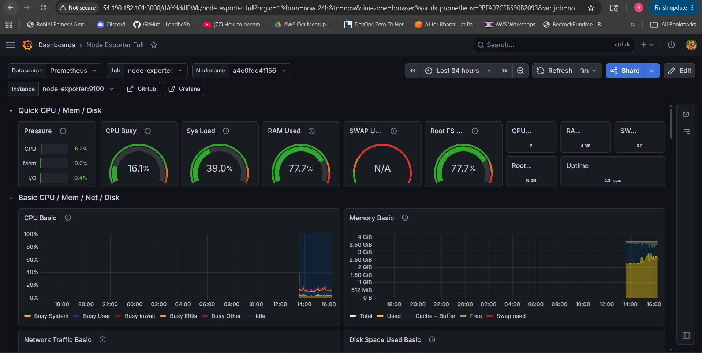

# SkillPulse — DevOps, DevSecOps & Observability Platform

## Overview

SkillPulse is a full-stack three-tier application built using modern DevOps and cloud-native practices.

The project demonstrates:

- CI/CD with GitHub Actions
- Dockerized frontend and backend services
- Monitoring and observability
- Centralized logging
- OpenTelemetry integration
- Kubernetes cluster setup using Kind
- Docker image optimization
- Multi-environment deployment concepts

---

# Application Stack

## Frontend
- HTML + CSS + vanilla JS, served by Nginx

## Backend
-	Go 1.26 + Gin

## Database
- MySQL 8.4

---

# DevOps & Observability Stack

- Docker
- Docker Compose
- GitHub Actions
- Kind Kubernetes Cluster
- Prometheus
- Grafana
- Loki
- Promtail
- cAdvisor
- Node Exporter
- OpenTelemetry Collector

---

# Features

## Application Features

- Skill management APIs
- Dashboard APIs
- RESTful backend services
- Health check endpoints
- MySQL integration

## DevOps Features

- Automated CI/CD pipeline
- Parallel GitHub Actions jobs
- Multi-stage Docker builds
- Docker image optimization
- DockerHub image publishing
- Infrastructure monitoring
- Container monitoring
- Centralized logging
- OpenTelemetry integration
- Kubernetes-ready architecture
- Infrastructure provisioning with Terraform
- Server configuration management with Ansible

---

## DevSecOps Features

- Docker image scanning
- Secret scanning
- Secure CI/CD workflows
- Git ignore for sensitive files
- Environment variable management
- Optimized and secure container images

---

# Automation

Implemented shell scripting automation for:

- Docker installation
- Kind Kubernetes cluster setup
---

# Infrastructure Automation

## Terraform

Terraform is used for:

- Infrastructure provisioning
- EC2 instance creation
- Networking setup concepts
- Multi-environment deployment structure

## Ansible

Ansible is used for:

- Server configuration management
- Make installation automation
- kubctl installation
- Environment setup automation


# CI/CD Pipeline

Implemented GitHub Actions workflow with:

- Parallel frontend and backend builds
- Docker Buildx caching
- DockerHub image push
- Optimized Docker layers
- Reusable workflows
- Conditional deployment support

---

# Docker Optimization

Implemented backend image optimization using:

- Multi-stage Docker builds
- Distroless runtime image
- CGO disabled build
- Trimmed Go binaries
- Docker layer caching

Example:

```dockerfile
RUN CGO_ENABLED=0 GOOS=linux go build \
    -ldflags="-s -w" \
    -trimpath \
    -o skillpulse .
```

---

# Monitoring & Observability

## Prometheus

Used for:

- Application metrics
- Infrastructure metrics
- Container metrics
- OpenTelemetry metrics

## Grafana

Used for:

- Visualization dashboards
- Monitoring dashboards
- Metrics analysis

## cAdvisor

Used for:

- Docker container monitoring
- CPU usage monitoring
- Memory usage monitoring
- Network statistics

## Node Exporter

Used for:

- EC2 system metrics
- CPU monitoring
- RAM monitoring
- Disk monitoring

---

# Centralized Logging

## Loki

Centralized log aggregation system.

## Promtail

Collects Docker container logs and forwards them to Loki.

---

# Kubernetes

Implemented local Kubernetes cluster using Kind with:

- 1 control-plane node
- 2 worker nodes

Used for:

- Kubernetes learning
- Deployment testing
- Container orchestration

---

# Security & DevSecOps

Implemented:

- Docker image scanning
- Secret scanning
- Optimized CI/CD practices
- Git ignore for sensitive files

---

# Running the Project

## Start Application

```bash
docker compose up -d
```

## Start Observability Stack

```bash
cd observability
docker compose up -d
```

# Access Services

| Service | Port |
|---|---|
| Frontend | 80 |
| Backend | 8080 |
| MySQL | 3306 |
| Prometheus | 9090 |
| Grafana | 3000 |
| Loki | 3100 |
| cAdvisor | 8000 |
| OTEL Collector | 4317 / 4318 |

---

# Useful PromQL Queries

## CPU Usage

```promql
rate(container_cpu_usage_seconds_total[1m])
```

## Memory Usage

```promql
container_memory_usage_bytes
```

## OTEL Spans

```promql
test_requests_total
```

# Screenshots

## Grafana Dashboard



## Prometheus Targets


## Loki Logs


## GitHub Actions Pipeline


---

# Future Improvements

- Terraform infrastructure provisioning
- EKS deployment
- Helm charts
- ArgoCD GitOps
- Alertmanager integration
- Horizontal scaling
- Multi-environment deployments

---

# Learning Outcomes

This project helped in learning:

- Docker
- Kubernetes
- CI/CD
- GitHub Actions
- Monitoring
- Logging
- OpenTelemetry
- Observability engineering
- DevSecOps practices
- Cloud-native tooling

---
